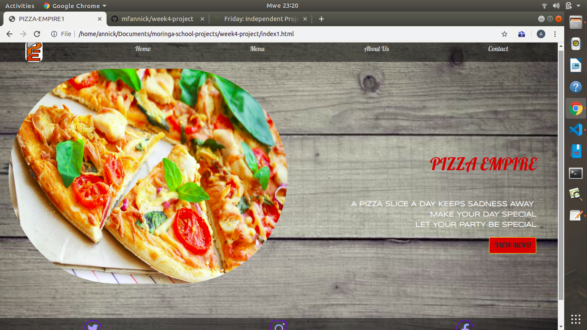

# week4-project
 PIZZA EMPIRE
## DILANI STUDIO
 This project is for designing web application where customers order different sizes of pizzas with one or more toppings. 
 ## Author's Name
 Annick Francine MAJYAMBERE 
 A new web-developer
  ## Setup instructions
  
    -Visit the website using the github [online link](https://mfannick.github.io/week4-project)

  ### BDD
  

  | command | Description | How to run |
  | --- | --- |-----|
  | using html,css and javascript/jquery  | web application for selling pizza online | Visit the website 
  
   
   
   #### Technologies used

     -HTML
     -CSS Styling
     -Bootstrap
     -Javascript/jquery
   
   ### Contact information
    
    Phone number=+250786409154
    Email:mfannick1@gmail.com

  ### MIT License and Copyright information
   
  [MIT](https://choosealicense.com/licenses/mit/)
  Copyright &copy;2019 Annick-Francine-M
  
